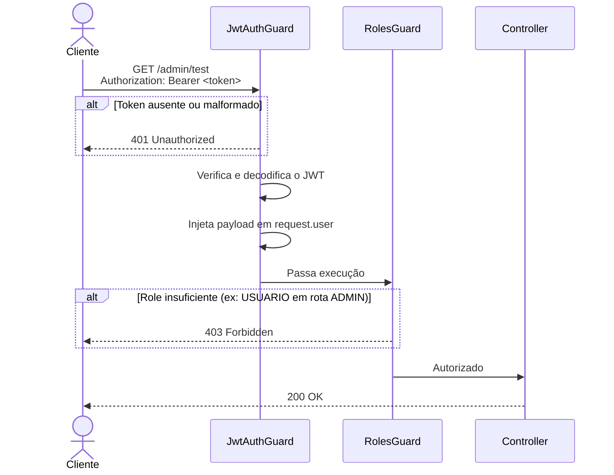

# Controle de Acesso por Role (RBAC)

## Visão geral

Este documento descreve a implementação do controle de acesso baseado em roles (RBAC — Role-Based Access Control) no backend do Conecta Paraná, realizada via **Decorator + Guard** no NestJS.

O mecanismo garante que endpoints sensíveis só possam ser acessados por usuários com a role adequada, extraída diretamente do JWT.

---

## Fluxo de autenticação e autorização


---

## Arquivos criados/alterados

| Arquivo | Tipo | Descrição |
|---|---|---|
| `src/common/enums/role.enum.ts` | Novo | Enum com as roles do sistema |
| `src/common/decorators/roles.decorator.ts` | Novo | Decorator `@Roles()` |
| `src/common/guards/jwt-auth.guard.ts` | Novo | Guard de autenticação JWT |
| `src/common/guards/roles.guard.ts` | Novo | Guard de autorização por role |
| `src/common/guards/jwt-auth.guard.spec.ts` | Novo | Testes unitários do JwtAuthGuard |
| `src/common/guards/roles.guard.spec.ts` | Novo | Testes unitários do RolesGuard |
| `src/app.controller.ts` | Alterado | Adicionado endpoint `GET /admin/test` |
| `src/app.controller.spec.ts` | Alterado | Atualizado para mockar JwtService e Reflector |
| `src/app.module.ts` | Alterado | Registrado `JwtModule` global |
| `src/config/env.validation.ts` | Alterado | Adicionada validação de `JWT_SECRET` |
| `.env` e `.env.example` | Alterado | Adicionada variável `JWT_SECRET` |
| `package.json` | Alterado | Adicionada dependência `@nestjs/jwt` |
| `test/app.e2e-spec.ts` | Alterado | Adicionados testes E2E do endpoint admin |

---

## Roles disponíveis

Definidas em `src/common/enums/role.enum.ts`:

| Role | Valor | Descrição |
|---|---|---|
| `Role.ADMIN` | `"ADMIN"` | Administrador com acesso total |
| `Role.USUARIO` | `"USUARIO"` | Usuário comum com acesso restrito |

---

## Como usar em novos endpoints

Para proteger um endpoint, aplique os dois guards na ordem correta e o decorator `@Roles()`:
```typescript
import { UseGuards } from '@nestjs/common';
import { JwtAuthGuard } from '../common/guards/jwt-auth.guard';
import { RolesGuard } from '../common/guards/roles.guard';
import { Roles } from '../common/decorators/roles.decorator';
import { Role } from '../common/enums/role.enum';

@Get('exemplo')
@UseGuards(JwtAuthGuard, RolesGuard)
@Roles(Role.ADMIN)
getExemplo() {
  return { message: 'Apenas admins chegam aqui' };
}
```

> ⚠️ A ordem dos guards **importa**: `JwtAuthGuard` deve vir antes de `RolesGuard`, pois é ele quem injeta o `user` no `request`.

---

## Estrutura do JWT esperado

O payload do token deve conter obrigatoriamente os campos:
```json
{
  "sub": "uuid-do-usuario",
  "role": "ADMIN"
}
```

O campo `role` deve corresponder a um dos valores do `Role` enum (`"ADMIN"` ou `"USUARIO"`).

---

## Variável de ambiente necessária

Adicione ao `.env`:
```env
# Gere com: node -e "console.log(require('crypto').randomBytes(64).toString('hex'))"
JWT_SECRET=seu-secret-seguro-aqui
```

---

## Comportamento por cenário

| Cenário | Status HTTP | Motivo |
|---|---|---|
| Sem header `Authorization` | `401` | Token não fornecido |
| Token mal formado / expirado | `401` | Token inválido |
| Token válido + role `USUARIO` em rota admin | `403` | Role insuficiente |
| Token válido + role `ADMIN` em rota admin | `200` | Acesso autorizado |
| Rota sem `@Roles()` | Livre | Guard passa sem verificar role |

---

## Testes

### Unitários
```bash
# Rodar todos os testes unitários
npm test

# Rodar apenas os guards
npm test -- --testPathPattern=guards
```

Cobertura dos testes unitários:

| Suite | Casos cobertos |
|---|---|
| `roles.guard.spec.ts` | Sem `@Roles()`, ADMIN, USUARIO, múltiplas roles, mensagem de erro |
| `jwt-auth.guard.spec.ts` | Token válido, ausente, malformado, expirado, extração do secret |

### E2E
```bash
# Requer banco e Redis rodando
docker compose up -d
npm run test:e2e
```

Cenários E2E cobertos em `test/app.e2e-spec.ts`:

- `GET /admin/test` sem token → `401`
- `GET /admin/test` com token inválido → `401`
- `GET /admin/test` com role `USUARIO` → `403`
- `GET /admin/test` com role `ADMIN` → `200`

---

## Endpoint de teste

| Método | Rota | Autenticação | Role mínima |
|---|---|---|---|
| `GET` | `/admin/test` | Bearer JWT | `ADMIN` |

**Resposta de sucesso (`200`):**
```json
{
  "message": "Acesso admin autorizado com sucesso"
}
```